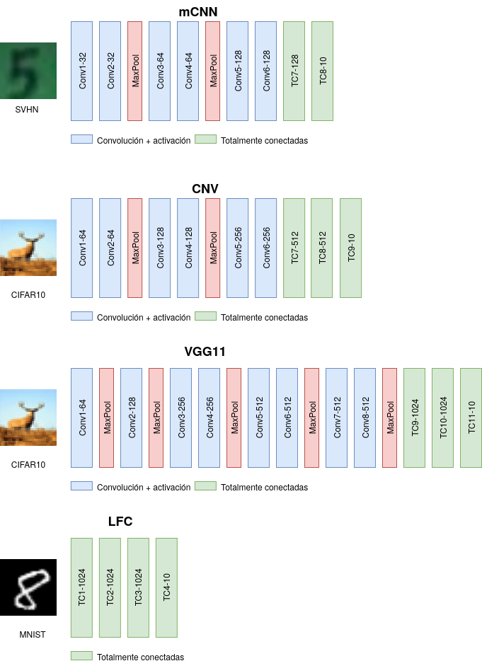

##  Comparison of Vitis-AI and FINN for implementing convolutional neural networks on FPGA (KV260)

This repository contains the LFC, mCNN, CNV, VGG11 models implemented in FINN and VITIS AI for the KV260 board. Full details are provided to evaluate performance, latency and power measurements on the FPGA.

### Abstract
Convolutional neural networks (CNNs) are essential for image classification and detection, and their implementation in embedded systems is becoming increasingly attractive due to their compact size and low power consumption. Field-Programmable Gate Arrays (FPGAs) have emerged as a promising option, thanks to their low latency and high energy efficiency.

Vitis AI and FINN are two development environments that automate the implementation of CNNs on FPGAs. Vitis AI uses a deep learning processing unit (DPU) and memory accelerators, while FINN is based on a streaming architecture and fine-tunes parallelization. Both environments implement parameter quantization techniques to reduce memory usage.

This work extends previous comparisons by evaluating both environments by implementing four models with different numbers of layers on the Xilinx Kria KV260 FPGA platform. The complete process from training to evaluation on FPGA, including quantization and hardware implementation, is described in detail.

The results show that FINN provides lower latency, higher throughput, and better energy efficiency than Vitis AI. However, Vitis AI stands out for its simplicity in model training and ease of implementation on FPGA. The main finding of this study is that as the complexity of the models increases (with more layers in the neural networks), the differences in terms of performance and energy efficiency between FINN and Vitis AI are significantly reduced.

## Models


## Prepare the SD for kria kv260
For this project is necessary use the Ubuntu 20.21, download the image from:
https://people.canonical.com/~platform/images/xilinx/kria/iot-kria-classic-desktop-2004-x03-20211110-98.img.xz?_gl=1*16usueu*_gcl_au*Mzk5MTE0ODkyLjE3MTExMDYyMjg.&_ga=2.59807085.1133415059.1711106229-1097448103.1710778457
- Extract the image:
```console
unxz iot-limerick-kria-classic-desktop-2204-x07-20230302-63.img.xz
```
- Format a SD:
```console
mkfs.exfat /dev/sdd
```
- Copy the img to the sd:
```console
dd if=iot-limerick-kria-classic-desktop-2204-x07-20230302-63.img of=/dev/sdd conv=fsync status=progress
```
- To setup the Kria KV260 following the steps of this link:
  https://www.amd.com/en/products/system-on-modules/kria/k26/kv260-vision-starter-kit/getting-started/getting-started.html
## Install KRIA-PYNQ for Vitis AI Models
```console
git clone https://github.com/Xilinx/Kria-PYNQ.git
cd Kria-PYNQ/
sudo bash install.sh -b KV260 
```
## Install FINN-Example for FINN Models
```console
pip3 install finn-examples --no-build-isolation
# to install particular git branch:
# pip3 install git+https://github.com/Xilinx/finn-examples.git@dev --no-build-isolation
```

## Evaluate the model in the kria kv260
- Open the jupyter lab in the browser with
```console
<ip_address>:9090/lab

```
## Upload Test Directoy
In the file explorer of jupyter lab you can upload files and folders. Upload the test folder of this repository.

## Download dataset
Before testing the models, it is necessary to download the datasets. For this work, CIFAR10, MNIST and SVHN (Cropped Digits) are used. They must be downloaded to the datasets folder. 
In the followings links you can download the datasets:
- CIFAR10: https://www.cs.toronto.edu/~kriz/cifar.html
- MNIST: https://git-disl.github.io/GTDLBench/datasets/mnist_datasets/
- SVHN: http://ufldl.stanford.edu/housenumbers/


## Test the models
To test the models you must navigate in the file explorer of the jupyter notebook, first choose if it is a model implemented in Vitis Ai or if it is a model implemented in Finn. Then search for the notebook of the corresponding model.
The structure of the files is detailed below.
```
.
└── test
    ├── datasets
    ├── finn
    │   ├── CNN_1W1A_SVHN.ipynb
    │   ├── CNV_1W1A_CIFAR10.ipynb
    │   ├── LFC_1W1A_MNIST.ipynb
    │   ├── models
    │   │   ├── cnn_1w1a_v3.bit
    │   │   ├── cnn_1w1a_v3.hwh
    │   │   ├── cnv_1w1a_opt.bit
    │   │   ├── cnv_1w1a_opt.hwh
    │   │   ├── lfc_1w1a.bit
    │   │   ├── lfc_1w1a.hwh
    │   │   ├── vgg11_1w1a_v2.bit
    │   │   └── vgg11_1w1a_v2.hwh
    │   └── VGG11_1W1A_CIFAR10.ipynb
    ├── power_measurement
    │   └── power_measurement.ipynb
    └── vitis-ai
        ├── CNN_SVHN_int8.ipynb
        ├── CNN_SVHN_KV260.xmodel
        ├── CNV_int8.ipynb
        ├── CNV.xmodel
        ├── LFC_MNIST_int8.ipynb
        ├── LFC_MNIST_KV260_v2.xmodel
        ├── LFC_MNIST_KV260.xmodel
        ├── VGG11_CIFAR10_KV260.xmodel
        └── VGG11_int8.ipynb
```
## Power measurement
To record the power measurement it is necessary to open 2 tabs in the jupyter lab, first the power measurement recording routine is launched, and then in the 2nd tab the evaluation cell of a model is launched.

## Thanks
The following repositories were used to create this work:

- https://github.com/Xilinx/finn-examples
- https://github.com/Xilinx/brevitas
- https://github.com/Xilinx/finn
- https://github.com/Xilinx/Kria-PYNQ
- https://github.com/Xilinx/Vitis-AI
- https://github.com/Xilinx/Vitis-AI-Tutorials
